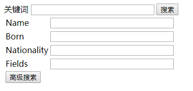
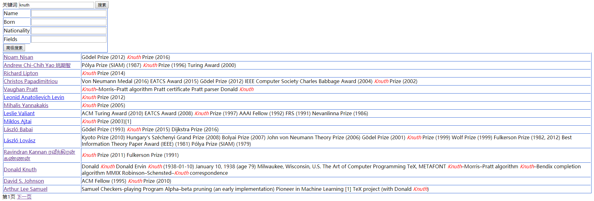
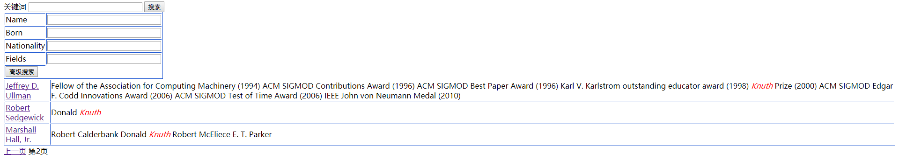
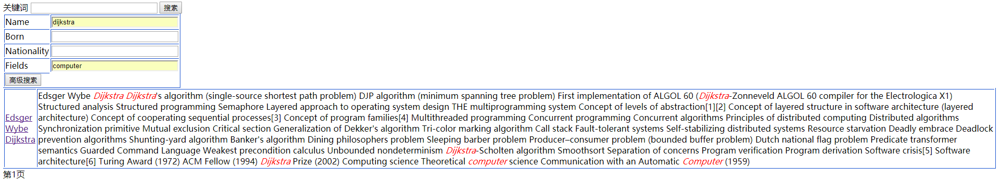
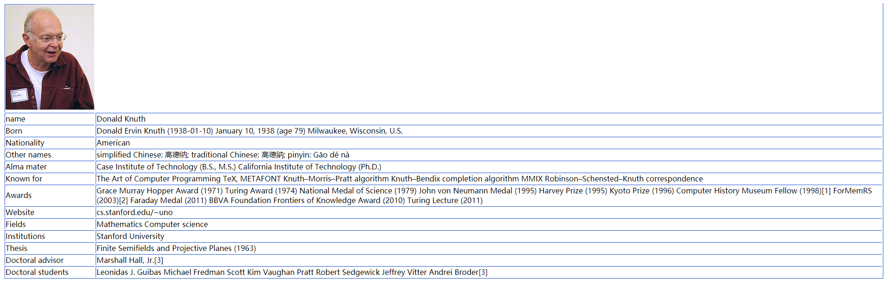
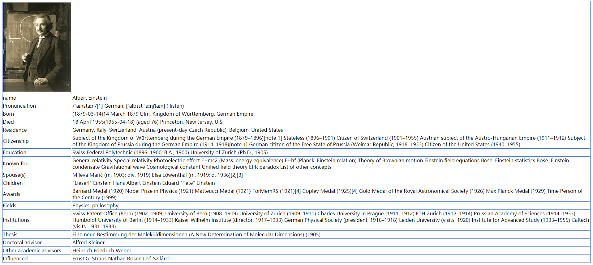
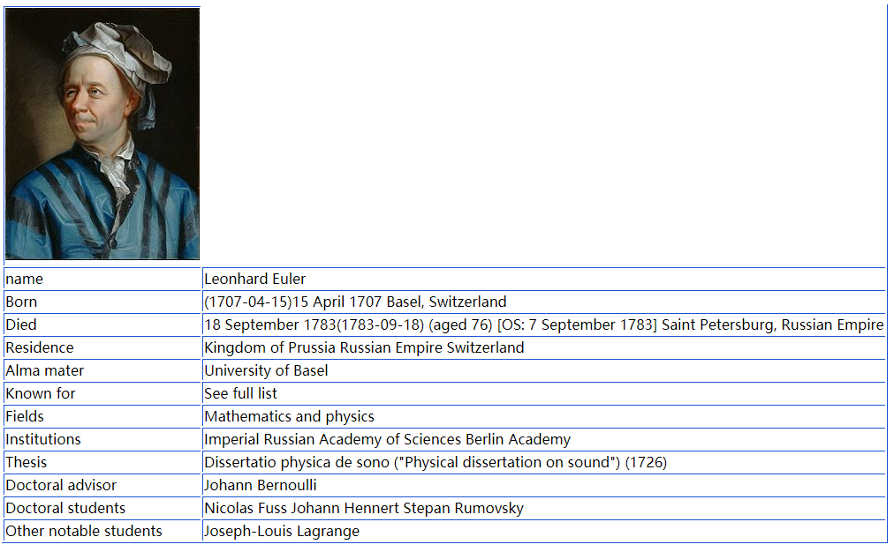
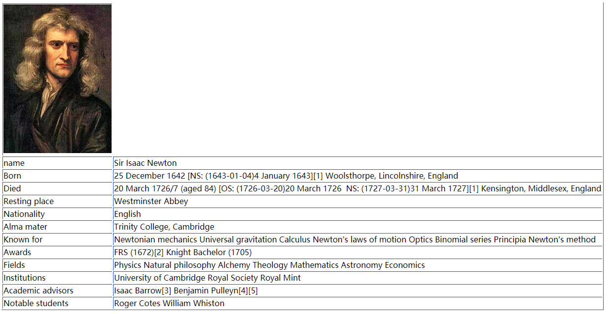

# SearchPeople

## 实现功能：

1. 爬取wikipedia中的10041个人物信息，包括了计算机科学家，数学家，物理学家和化学家分类

2. 抽取页面上infobox中的内容，存储在文件中

3. 在每次启动时建立关键字到人的倒排列表

4. 使用Django渲染模板，对浏览器端提交的搜索请求进行响应，返回包含关键字链接的结果并高亮关键字

5. 实现了搜索结果的分页显示

6. 可以对人物按照姓名，国籍，研究领域等字段针对性查询

## 运行效果：

1. 搜索框

<!--  -->

2. 关键词搜索与高亮(第一页结果)

<!--  -->

3. 关键词搜索与高亮(第二页结果)

<!--  -->

4. 根据不同字段针对性查找

<!--  -->

5. 点击搜索结果链接后的详细信息展示

 - Knuth 大师

 

 <!--  -->

 - Albert Einstein

 

 <!--  -->

 - 成果多到页面显示不下的 Euler

 

 <!--  -->

 - Isaac Newton

 

 <!--  -->

## 模块划分：

### 爬虫(`./crawler`文件夹下)：

- 这个爬虫是此次大作业里让我花费了最多时间的一个部分。爬取一万人，把每个分类下面的人物悉数爬取到，做到尽可能少地遗漏确实感觉不容易。

- 反反爬手段：使用chrome浏览器请求头的user-agent信息，两个网页间隔1~5s爬取。

- 防断网，防反爬，防崩溃手段：每爬取一定数量的网站自动把已经爬取的网址，将要爬取的网址，已经爬取的人物数量写进log中，下次启动的时候从记录恢复

### 倒排列表(`./InvertedList`文件夹下)：

- 通过正则表达式将句子替换标点，按空格分词找到关键词，建立关键词到文档的对应列表

### 网站后台(`./SearchPeople`文件夹下)：

- 基本就是写一堆处理请求，渲染页面并返回的函数，照着网上的教程一步步写就好

### 网页模板(`./templates`文件夹下)：

- 打开百度，搜狗，google的主页<del>各种借鉴</del>

## 大作业感想与心路历程

1. python写起来好舒服啊，很多情况下完全不用写一堆烦人的for(......){}

2. 用户界面好难啊，随便凑合一个吧

3. 小学期终于结束了，完结撒花！

